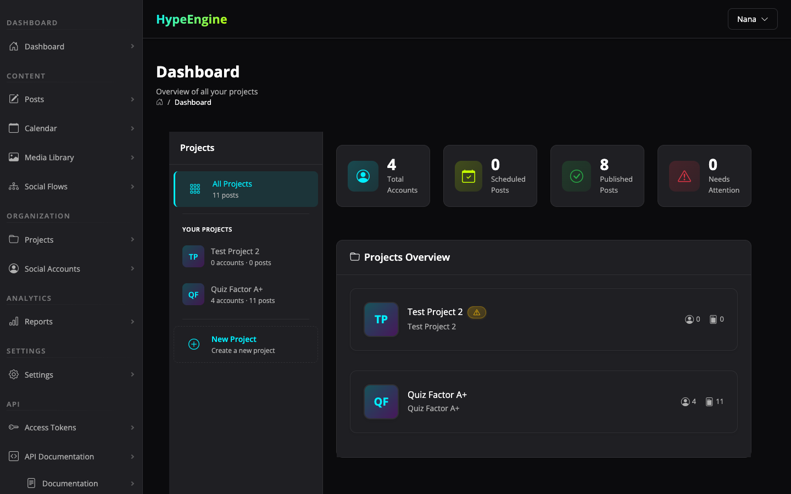
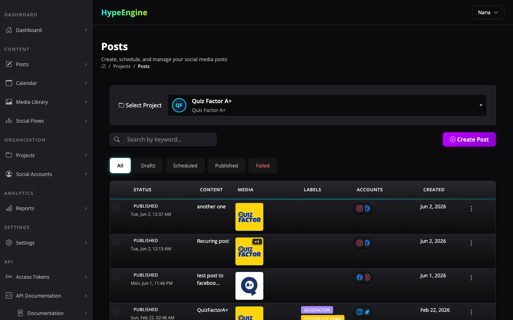
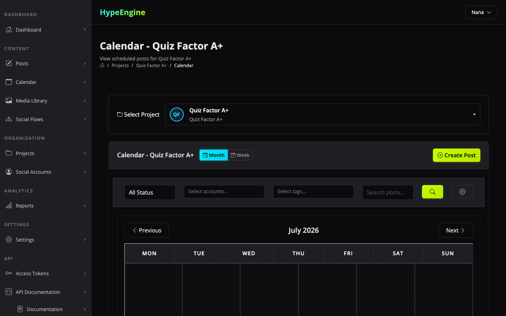
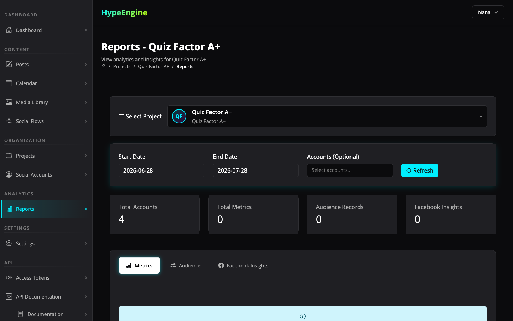

# Hype Engine marketing media

These assets show the hosted Hype Engine demo at a 1440×900 desktop viewport.
They are suitable for the project README, release announcements, launch posts,
and repository listings.

## Product tour

[Watch the 78-second Hype Engine product tour](video/hype-engine-product-tour.webm).

The tour covers the project dashboard, post management, and content calendar.

## Screenshots

### Dashboard

### Post management

### Content calendar

### Reports

## Asset notes

- Captured from the live demo on July 28, 2026.
- Screenshots are PNG files at 1440×900.
- The product tour is a silent VP8 WebM at 1440×900.
- Demo project names and example post content are visible; credentials, access
  tokens, and authentication forms are not.
